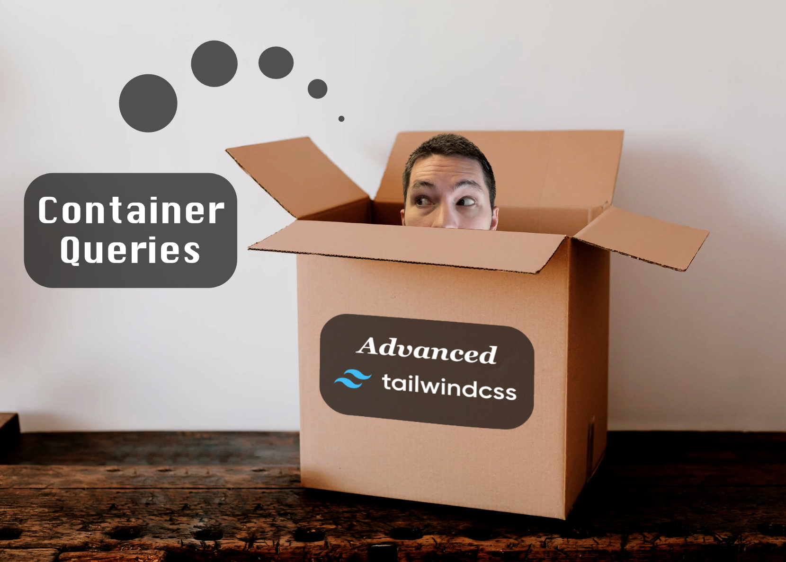
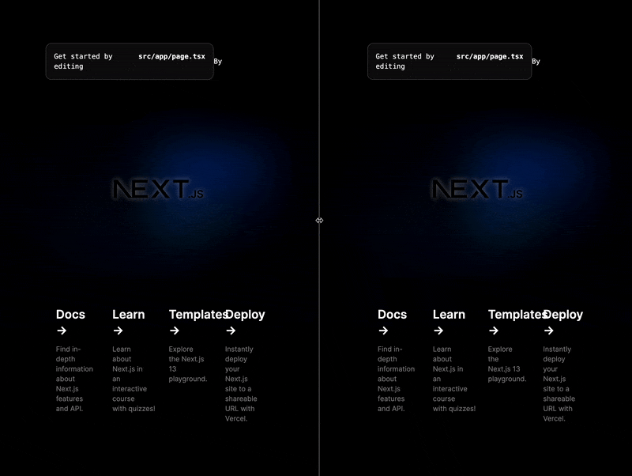
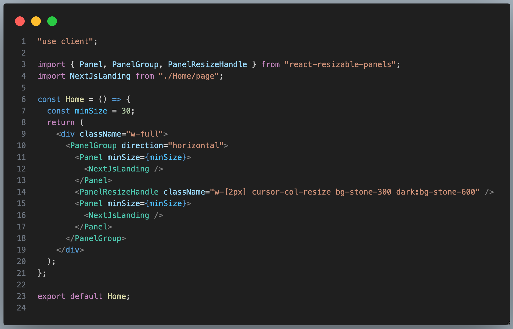
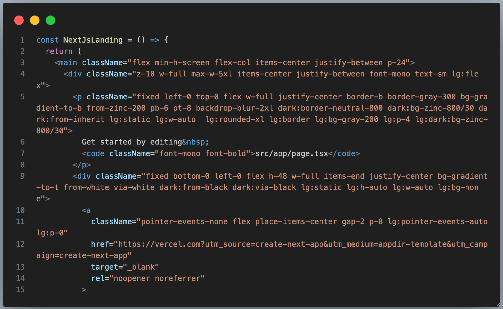
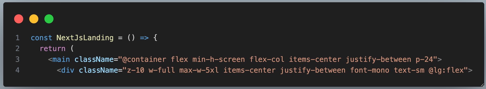
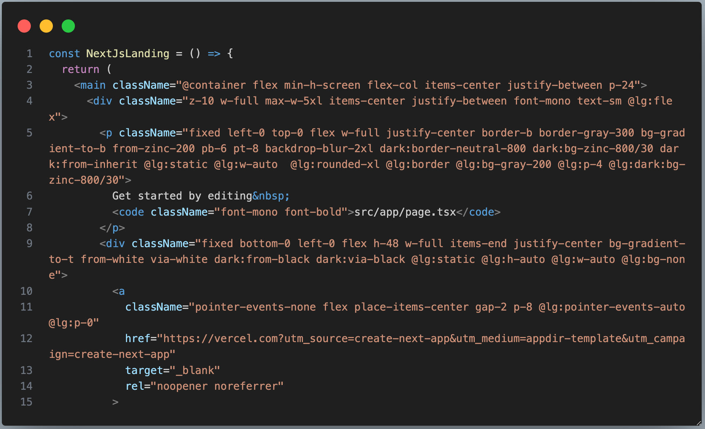
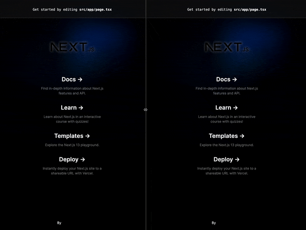

# Advanced Tailwind - Container Queries



Tailwind provides a lot of value for standardizing design tokens and stylesheets. I've been using it in every web based project for the last year, and being able to share components between projects and domains without restructuring style sheets is an incredible boost to productivity. Tailwind's media queries, more specifically, are one of my favorite features. With such ease you can define standardized style behaviors for different screen sizes directly in the `className` props:

`<div className="sm:col-2 md:col-4 lg:col-8"/>`

Tailwind provides a [list of aliases](https://tailwindcss.com/docs/screens) for these queries, which are by default mapped to standard screen sizes. We can always extend this to match our own numbers, of course.

So where's the problem? This post isn't about media queries, but *container queries.* I consider container queries to be an advanced technique for Tailwind as it involves using plugins, and fits a specific use-case. Before I explain what a container query is, let's look at the problem we're trying to solve that media queries cannot.

Consider a website that has a user-controlled, resizable panel which is used for side-by-side views. This is often used for cross-referencing websites where you can see multiple, completely different pieces of content at the same time. I put together a bare-bones example using NextJs to illustrate this below:



I created the panels using the [react-resizable-panels](https://github.com/bvaughn/react-resizable-panels) library, and am just displaying the default NextJs landing component in both panels:



The issue is that the default NextJs landing page includes media queries to handle mobile views! Why aren't they being respected when the panels are resized? Why do they look dumb when the panels are small? Look at the default code below and spot the media queries. They're definitely there, but nothing's happening!



This is simply because Tailwind media queries are based on the browser window's size. They will never change unless the browser window is changed. They don't know anything about the panel sizes. How do we get a media query to monitor the size of its parent `div`, instead of the browser window? This is where container queries come in, because this is exactly what they're for.

### Installation

[Container queries](https://github.com/tailwindlabs/tailwindcss-container-queries) are a Tailwind plugin, so they need to be installed first by following these steps:

1. `npm install @tailwindcss/container-queries`
2. Add this to your `tailwind.config.js` file:

```
plugins: [
    require('@tailwindcss/container-queries'),
    // ...
  ],
```

### Usage

Essentially, we mark our media query aliases with a new container flag `@container`, or if you want a unique name in the case of more complex designs, you can write `@container/{name}`:



This tells any child components that if their media queries are also flagged, they will monitor only the parent's size. See the `@lg:flex` flag in the `div`? The `@` will make the `lg:` alias track the `@container`.

So with this new tech, we can just do a find-all on media queries in this component, and add the `@` marker. It will begin to look like this:



After running this now, we'll see that our content inside the panels are now respecting the parent component sizes, and we didn't have to rewrite our media queries at all! Aside from just adding a `@` to each one.



I think this is amazing if you have a similar use-case, and makes container queries incredibly easy to implement. The next time you have to deal with resizable panels, or even just child components that need a slightly more advanced twist on their styling, take a look at Tailwind's container query plugin!
